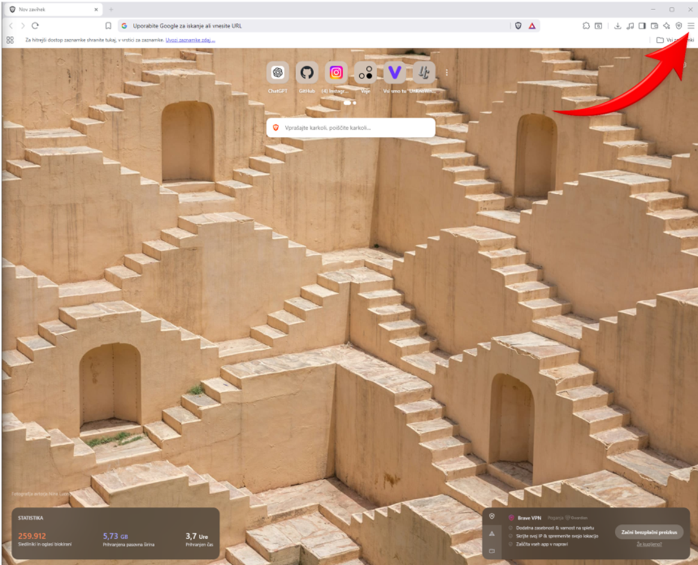
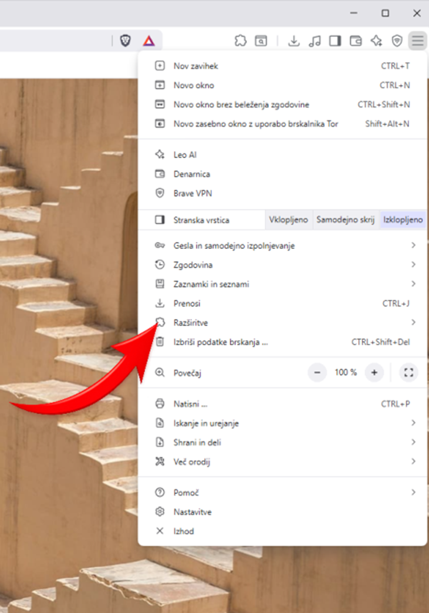
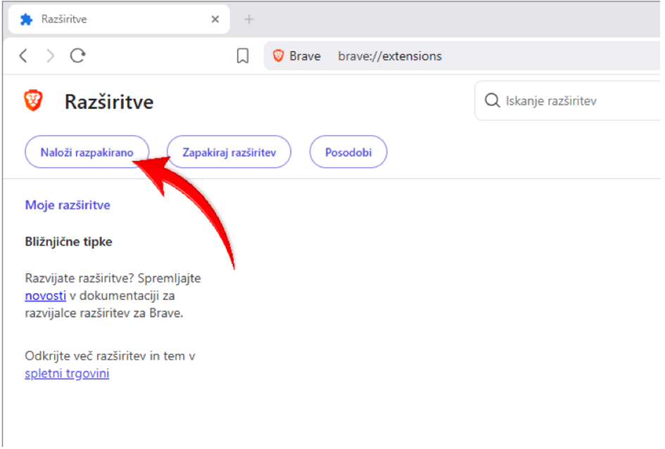
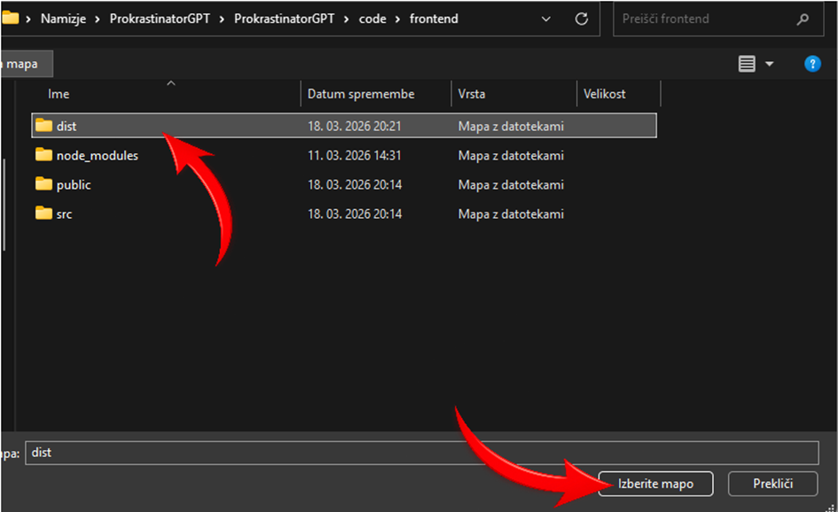
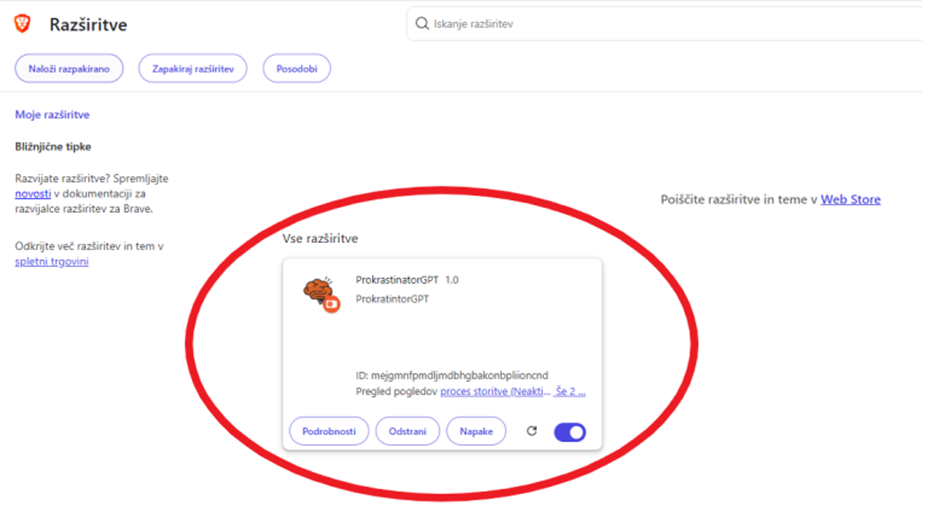

# Namestitev razširitve v Brave

Ta vodič prikazuje, kako ročno naložiš razširitev `ProkrastinatorGPT` v brskalnik Brave.

## Predpogoji

Pred začetkom preveri:

- da imaš zgrajeno razširitev v mapi `code/frontend/dist`
- da uporabljaš lokalno kopijo projekta `ProkrastinatorGPT`

Mapa, ki jo boš izbral v Brave, je:

```text
code/frontend/dist
```

## Koraki namestitve

### 1. Odpri meni v brskalniku Brave

V zgornjem desnem kotu klikni ikono menija.



### 2. Izberi možnost Razširitve

V spustnem meniju klikni `Razširitve`.



### 3. Vklopi način za razvijalce

Na strani `brave://extensions` v zgornjem desnem kotu vklopi stikalo `Način za razvijalce`.


### 4. Klikni Naloži razpakirano

Ko je način za razvijalce vklopljen, klikni gumb `Naloži razpakirano`.



### 5. Izberi mapo dist

V raziskovalcu datotek odpri mapo projekta, nato pojdi v `code/frontend` in izberi mapo `dist`. Nato klikni `Izberite mapo`.



### 6. Preveri, da je razširitev uspešno naložena

Če je bila namestitev uspešna, se bo na strani z razširitvami prikazala kartica `ProkrastinatorGPT`. Preveri tudi, da je razširitev vklopljena.



## Če razširitve ne vidiš

Preveri naslednje:

- da si izbral mapo `code/frontend/dist` in ne `src` ali `public`
- da mapa `dist` vsebuje datoteko `manifest.json`
- da je razširitev po nalaganju ostala vklopljena

## Opomba

Če spremeniš kodo razširitve, jo običajno ponovno zgradiš in nato na strani `brave://extensions` klikneš ikono za osvežitev razširitve.
