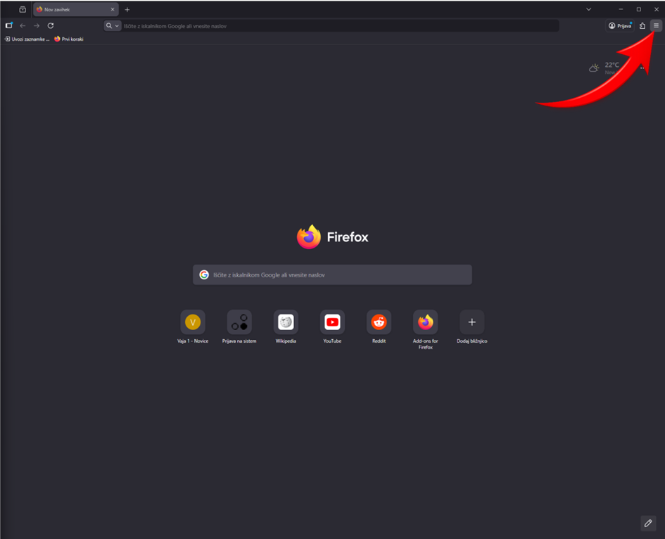
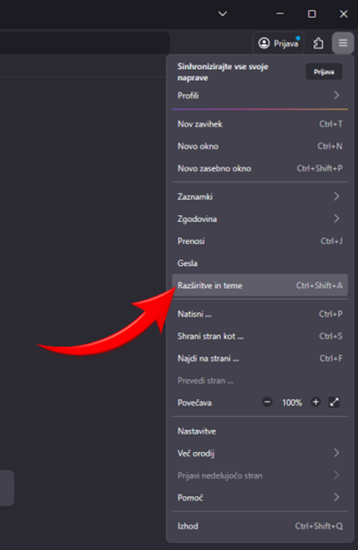
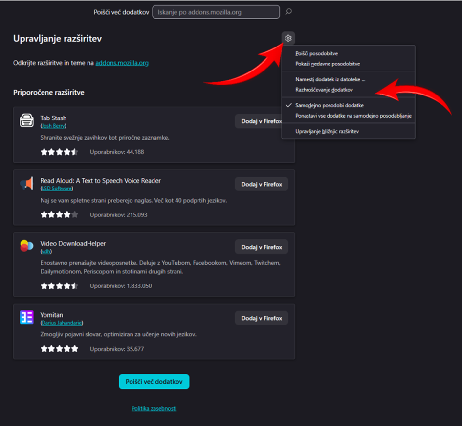
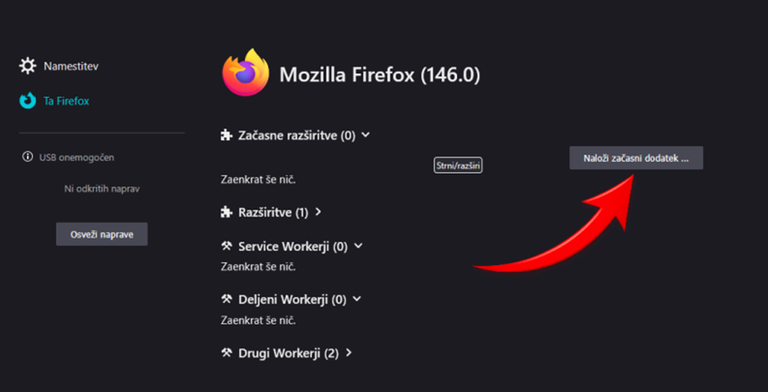
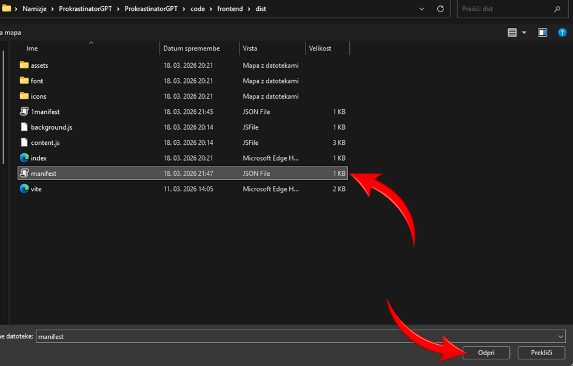
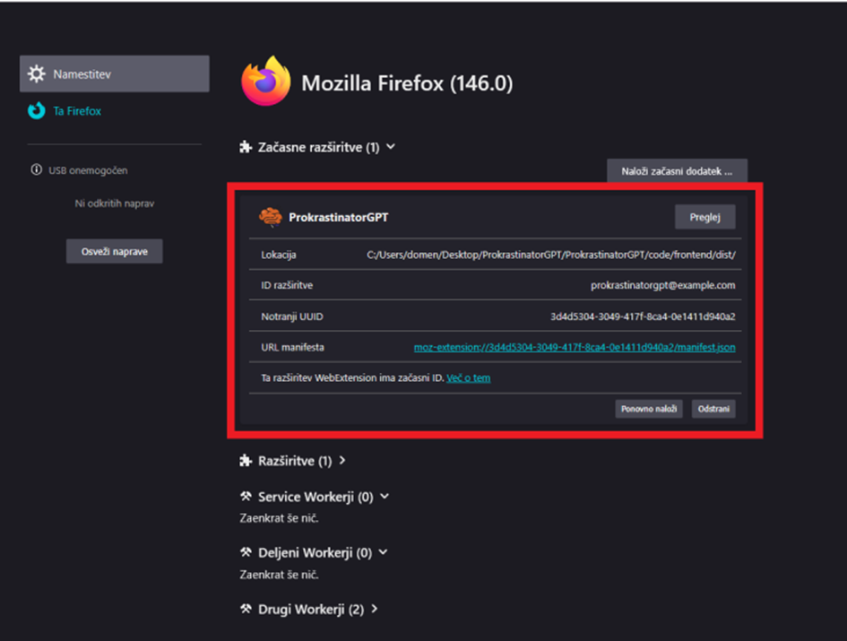

# Namestitev razširitve v Firefox

Ta vodič prikazuje, kako ročno naložiš razširitev `ProkrastinatorGPT` v brskalnik Mozilla Firefox.

## Predpogoji

Pred začetkom preveri:

- da imaš zgrajeno razširitev v mapi `code/frontend/dist`
- da uporabljaš lokalno kopijo projekta `ProkrastinatorGPT`
- da imaš v mapi `code/frontend/dist` tudi Firefox manifest datoteko

Firefox uporablja začasno nalaganje dodatka, zato se razširitev običajno odstrani, ko zapreš brskalnik. Po ponovnem zagonu jo moraš naložiti znova.

## Koraki namestitve

### 1. Odpri meni v Firefoxu

V zgornjem desnem kotu klikni ikono menija.

### 2. Odpri Razširitve in teme

V meniju klikni `Razširitve in teme`.

### 3. Odpri razhroščevanje dodatkov

Na strani za upravljanje razširitev klikni ikono zobnika in nato izberi `Razhroščevanje dodatkov`.

### 4. Naloži začasni dodatek

Na strani za razvijalsko razhroščevanje klikni gumb `Naloži začasni dodatek ...`.

### 5. Izberi Firefox manifest datoteko

V raziskovalcu datotek odpri mapo projekta, nato pojdi v `code/frontend/dist` in izberi Firefox manifest datoteko. V tej pripravi je to datoteka `manifest_firefox.json`.

### 6. Preveri, da je razširitev uspešno naložena

Če je bila namestitev uspešna, se bo razširitev `ProkrastinatorGPT` prikazala v razdelku `Začasne razširitve`.

## Če razširitve ne vidiš

Preveri naslednje:

- da si odprl pravilno mapo `code/frontend/dist`
- da si izbral Firefox manifest datoteko
- da datoteka vsebuje veljaven Firefox WebExtension manifest

## Opomba

Ker gre v Firefoxu za začasno naložen dodatek, ga boš moral po zaprtju brskalnika ponovno naložiti. Če spremeniš kodo razširitve, jo ponovno zgradi in nato dodatek znova naloži ali uporabi `Ponovno naloži`.
